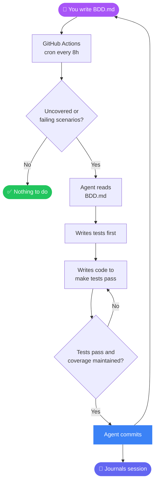

# BAADD — Behaviour and AI Driven Development
<div align="center">


</div>

[](https://github.com/dweng0/BAADD/actions/workflows/evolve.yml) [](https://github.com/dweng0/BAADD/actions/workflows/ci.yml)

## Supported Models

BAADD auto-detects your provider from environment variables. Set one API key and run — no config needed.

| Provider | Environment Variable | Default Model | Notes |
|----------|---------------------|---------------|-------|
| **Anthropic** | `ANTHROPIC_API_KEY` | `claude-sonnet-4-5` | Highest priority; native tool use |
| **OpenAI** | `OPENAI_API_KEY` | `gpt-4o` | |
| **Groq** | `GROQ_API_KEY` | `llama-3.3-70b-versatile` | Fast inference |
| **Alibaba / Qwen** | `DASHSCOPE_API_KEY` | `qwen-max` | OpenAI-compatible endpoint |
| **Moonshot / Kimi** | `MOONSHOT_API_KEY` | `moonshot-v1-8k` | OpenAI-compatible endpoint |
| **Ollama** | `OLLAMA_HOST` | _(pass `--model`_) | Local models, no API key required |

Provider priority (first key found wins): `ANTHROPIC_API_KEY` > `MOONSHOT_API_KEY` > `DASHSCOPE_API_KEY` > `OPENAI_API_KEY` > `GROQ_API_KEY` > `OLLAMA_HOST`

Override the model at any time with `--model <name>` or force a provider with `--provider <name>`.

---

# The task

Write software by describing its behaviour in a `BDD.md` file.

## The twist

- An AI agent reads the BDD spec and writes code to satisfy it
- The agent commits only when tests pass and coverage is maintained
- The agent journals its actions and learns from experience

## The goal

> Build useful software using human-readable specifications, never having to write code manually.

---

## How it works



1. You write `BDD.md` — features, scenarios, given/when/then
2. A GitHub Actions cron job fires every 8 hours
3. The AI agent reads `BDD.md`, finds uncovered or failing scenarios
4. It writes tests first, then writes code to make them pass
5. It commits only when tests pass and BDD coverage is maintained
6. It journals what it did and responds to GitHub issues

> **The agent never builds anything that isn't in BDD.md.**

---

## Setup

### 1. Configure BDD.md

Edit the frontmatter at the top of `BDD.md`:

```yaml
---
language: typescript        # rust | python | go | node | typescript | java
framework: react-vite       # or: none, express, django, etc. (informational)
build_cmd: npm run build
test_cmd: npm test
lint_cmd: npm run lint
fmt_cmd: npm run format
birth_date: 2026-01-01      # project start date (used for day counter)
---
```

Then write your features and scenarios below the frontmatter.

### 2. Add your Anthropic API key

In your GitHub repo: **Settings → Secrets and variables → Actions → New repository secret**

| Name | Value |
|------|-------|
| `ANTHROPIC_API_KEY` | your `sk-ant-...` key |

### 3. Install agent dependencies

```bash
pip install anthropic
```

### 4. Run manually

```bash
ANTHROPIC_API_KEY=sk-... ./scripts/evolve.sh
```

### 5. Let it run on schedule

Push to GitHub. The workflow runs automatically every 8 hours via cron.

Trigger manually: **Actions tab → Evolution → Run workflow**.

---

## File reference

| File | Purpose |
|------|---------|
| `BDD.md` | The spec — edit this to drive development |
| `IDENTITY.md` | Agent constitution — do not modify |
| `JOURNAL.md` | Agent's full session logs — auto-written |
| `JOURNAL_INDEX.md` | One-line-per-session summary index — auto-generated |
| `LEARNINGS.md` | Agent's cached research — auto-written |
| `BDD_STATUS.md` | Scenario coverage status — auto-generated |
| `scripts/evolve.sh` | Main evolution loop — do not modify |
| `scripts/agent.py` | The AI agent runner |
| `scripts/check_bdd_coverage.py` | Scenario coverage checker |
| `scripts/parse_bdd_config.py` | BDD.md frontmatter parser |
| `scripts/setup_env.sh` | Language-aware toolchain installer |

---

## Writing good BDD scenarios

```gherkin
Feature: User authentication
    As a user
    I want to log in with my email and password
    So that I can access my account

    Scenario: Successful login
        Given I am on the login page
        When I enter valid email and password
        Then I am redirected to my dashboard

    Scenario: Wrong password
        Given I am on the login page
        When I enter a valid email but wrong password
        Then I see "Invalid email or password"
```

Keep scenarios:

- **Specific** — one behaviour per scenario
- **Observable** — the `Then` clause must be testable
- **Independent** — each scenario stands alone

---

## Using Claude Code interactively

If you have [Claude Code](https://claude.ai/code) installed, you can run evolution sessions interactively instead of waiting for the cron:

```
> evolve
```

Claude Code will read the spec, pick the next uncovered scenario, write the test, implement it, and commit — then ask if you want to continue. This uses the same workflow as the GitHub cron but lets you guide the session in real time.

---

## GitHub issues

Label issues with `agent-input` to have the agent pick them up.

If an issue proposes a new feature, the agent will add it to `BDD.md` as a Scenario before implementing it.