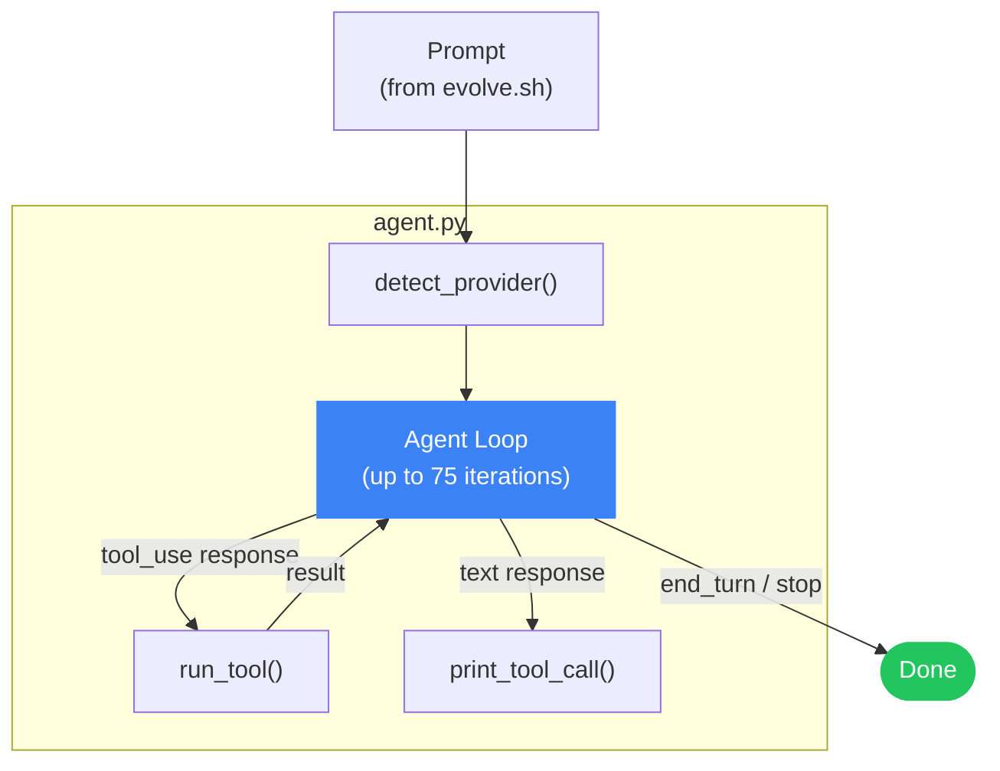
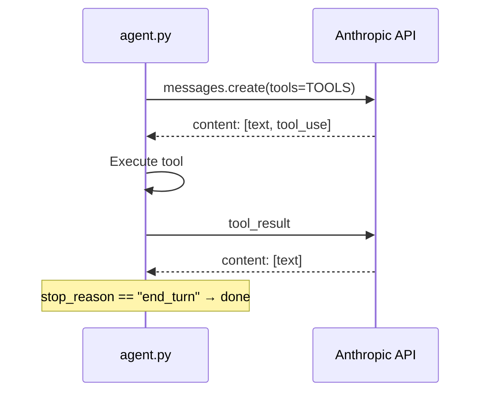
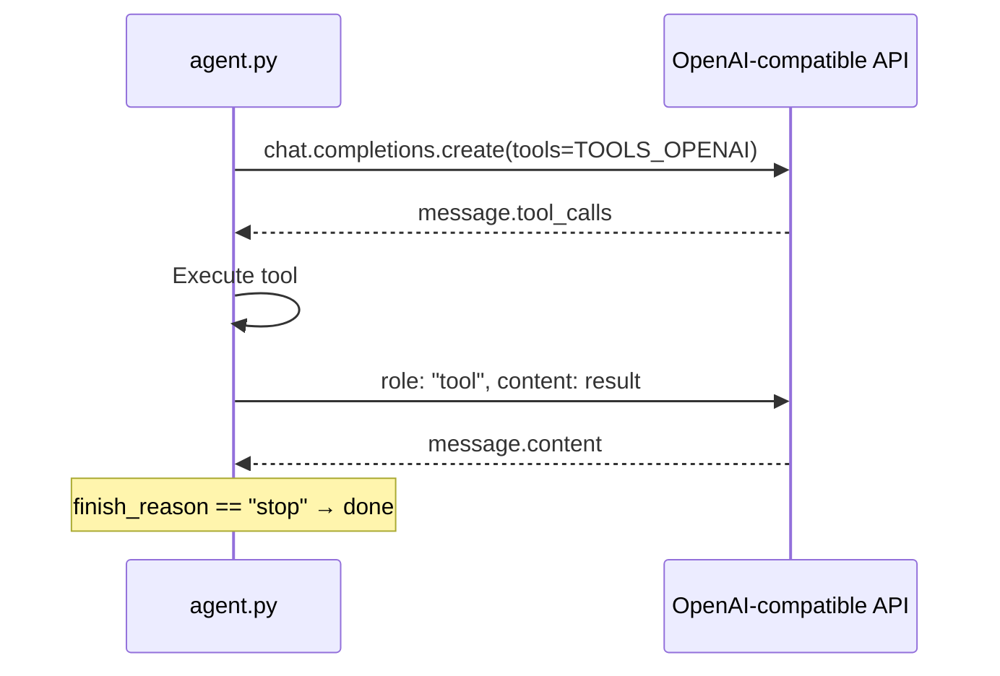

`scripts/agent.py` is the brain of poppins. It reads a prompt from stdin, runs an agent loop with tool use, and prints structured output.

## Architecture



## Two code paths

The agent supports two different API formats:

### Anthropic (native)
Uses the `anthropic` Python SDK directly with Anthropic's tool use format:



### OpenAI-compatible (all others)
Uses the `openai` Python SDK. Works with OpenAI, Groq, Moonshot, Alibaba, and Ollama:



## Iteration limits

| Threshold | What happens |
|-----------|-------------|
| 70 | Wrap-up reminder injected — stop starting new work |
| 75 | Hard stop — agent loop exits |

The wrap-up message tells the agent to finish current work, update coverage, write a journal entry, and commit.

## Tool output limits

All tool outputs are truncated to **12,000 characters** to stay within context limits. File reads and bash output are capped at this limit.

## CI-aware logging

When running in GitHub Actions (`CI=true`), the agent uses collapsible log groups:

```
::group::Agent [3/75]: Implementing the add task scenario...
  $ npm test
  ✓ 3 tests passed
::endgroup::
```

This keeps CI logs readable even for long sessions.

## Skills system

The agent can load skills from a `skills/` directory. Each skill is a `SKILL.md` file that gets appended to the system prompt. This lets you extend the agent's behaviour without modifying `agent.py`.
