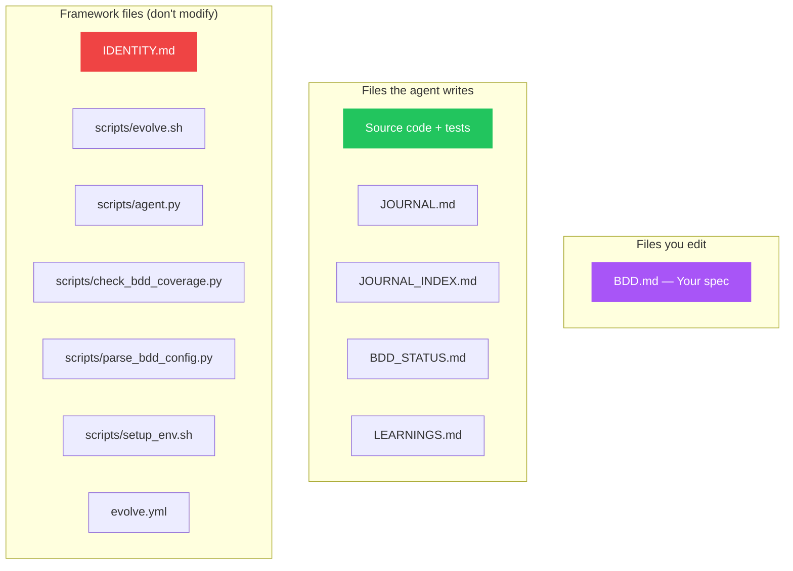

## Project structure

## File details

### Files you edit

| File | Purpose |
|------|---------|
| `BDD.md` | **The spec.** YAML frontmatter + Gherkin scenarios. This is the only file you need to edit to drive development. |

### Files the agent writes

| File | Purpose |
|------|---------|
| `JOURNAL.md` | Full session logs. The agent writes an entry after every session. |
| `JOURNAL_INDEX.md` | One-line-per-session summary table. Quick overview of all past sessions. |
| `BDD_STATUS.md` | Current coverage status — which scenarios have passing tests. |
| `LEARNINGS.md` | Agent's research cache. Things it looked up and learned. |
| `ISSUES_TODAY.md` | Formatted GitHub issues for the current session (transient). |
| `ISSUE_RESPONSE.md` | Agent's responses to issues (transient, processed by evolve.sh). |

### Framework files (do not modify)

| File | Purpose |
|------|---------|
| `IDENTITY.md` | Agent constitution — rules the agent must follow. |
| `scripts/evolve.sh` | Main orchestrator — sets up environment, runs the agent, verifies results. |
| `scripts/agent.py` | AI agent runner — multi-provider loop with tool use. |
| `scripts/check_bdd_coverage.py` | Parses `BDD.md` and checks which scenarios have matching tests. |
| `scripts/parse_bdd_config.py` | Reads `BDD.md` frontmatter and outputs shell variables. |
| `scripts/setup_env.sh` | Installs the language toolchain based on `BDD.md` config. |
| `.github/workflows/evolve.yml` | GitHub Actions workflow — cron trigger every 8 hours. |

### Metadata

| File | Purpose |
|------|---------|
| `.poppins` | Framework manifest — tracks installed version and file list. |
| `BDD.example.md` | Template spec for reference when writing your own `BDD.md`. |
| `DAY_COUNT` | Days since project birth date (used in journal headers). |

## What's safe to delete

- `JOURNAL.md`, `JOURNAL_INDEX.md` — the agent will recreate them next session
- `BDD_STATUS.md` — regenerated every session
- `LEARNINGS.md` — the agent will rebuild its knowledge
- `ISSUES_TODAY.md`, `ISSUE_RESPONSE.md` — transient files

## What must never be deleted

- `BDD.md` — your spec, the source of truth
- `IDENTITY.md` — agent constitution
- `scripts/` — the framework engine
- `.github/workflows/` — the automation
