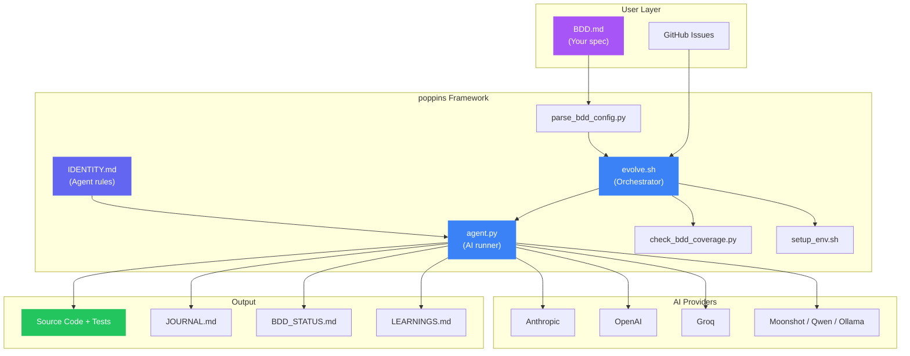
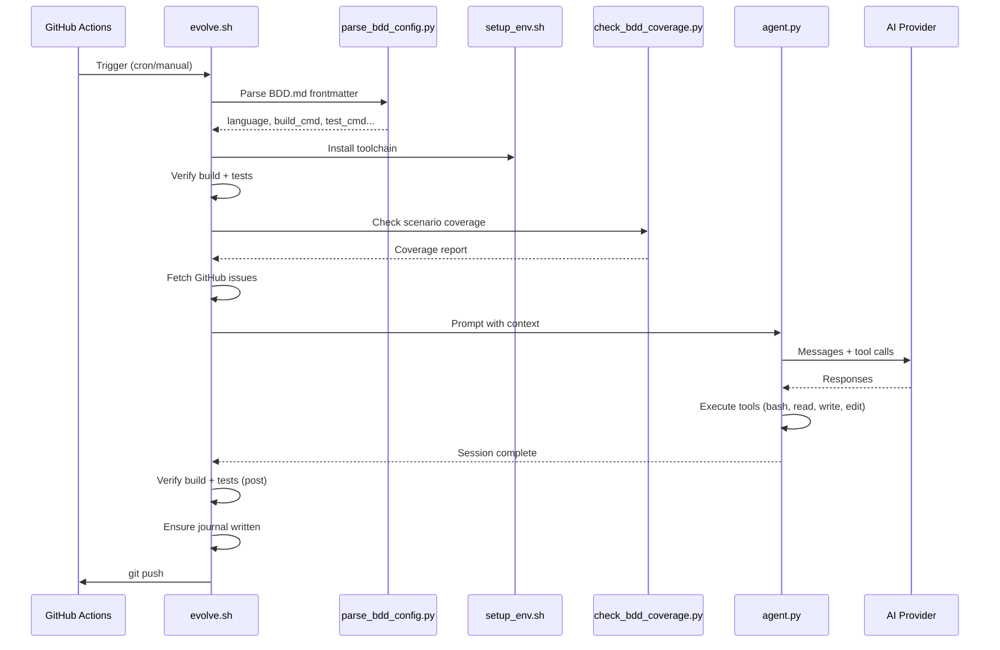
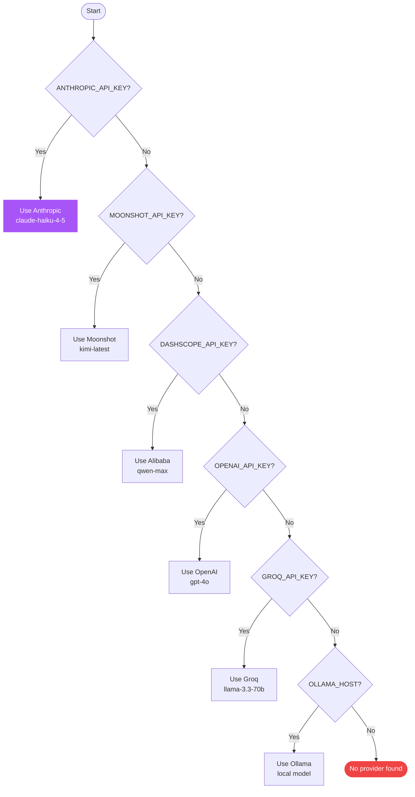
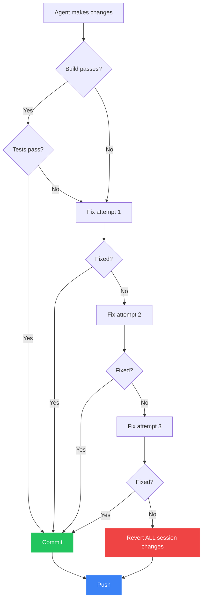

## System overview

## Data flow during a session

## Provider detection

The agent auto-detects which AI provider to use based on environment variables:

Anthropic uses its native API with tool use. All other providers use the OpenAI-compatible chat completions API.

## Tool system

The agent has 6 tools available:

| Tool | Description |
|------|-------------|
| `bash` | Run any shell command |
| `read_file` | Read file contents |
| `write_file` | Create or overwrite a file |
| `edit_file` | Replace a string in a file |
| `list_files` | List files recursively |
| `search_files` | Search for patterns across files |

The agent loop runs up to **75 iterations**. At iteration 70, a wrap-up reminder is injected to ensure the session ends cleanly with a journal entry.

## Safety guarantees

- The agent **never pushes broken code** — post-session verification catches failures
- After 3 failed fix attempts, the **entire session is reverted**
- The agent **never modifies** `IDENTITY.md`, `evolve.sh`, or `.github/workflows/`
- The agent **never builds features** not described in `BDD.md`
