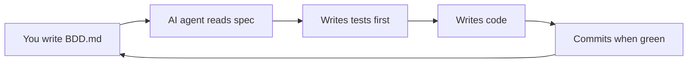
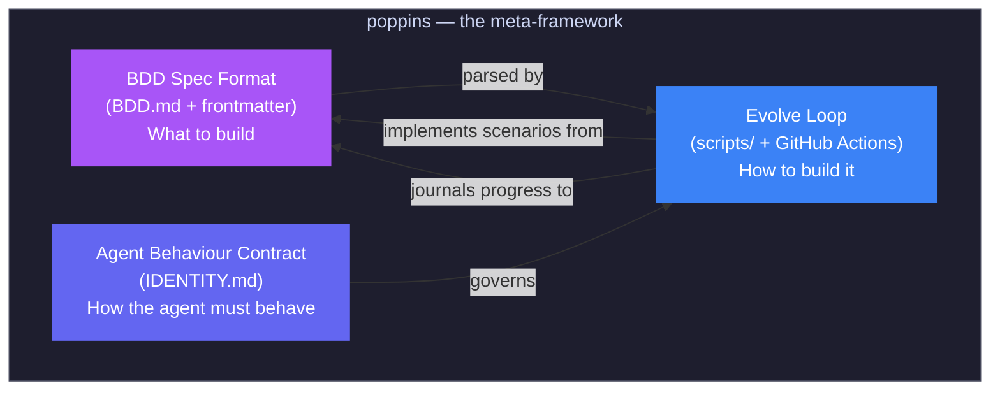

poppins (**B**ehaviour and **A**I **D**riven **D**evelopment) is a meta-framework where an AI agent builds and maintains a project driven entirely by BDD specifications.

## The idea

You describe **what** you want built using [Gherkin](https://cucumber.io/docs/gherkin/) scenarios. An AI agent figures out **how** to build it — writing tests first, then writing the minimum code to make them pass.

## Three pillars

poppins has three parts that work together:

1. **BDD Spec Format** — `BDD.md` with YAML frontmatter declaring language, build/test commands, and Gherkin scenarios. This is the only file you edit.
2. **Evolve Loop** — the `scripts/` + GitHub Actions cron that drives the agent: find uncovered scenario → write test → write code → commit.
3. **Agent Behaviour Contract** — `IDENTITY.md`, the agent's constitution. It defines what the agent can do, what it must never do, and how it measures progress.

## What makes it different

- **Spec-driven** — the agent never builds anything that isn't in `BDD.md`
- **Test-first** — every scenario gets a test before any implementation code
- **Self-healing** — if the build breaks, the agent reverts and journals the failure
- **Multi-provider** — works with Anthropic, OpenAI, Groq, Alibaba, Moonshot, or local Ollama
- **Language-agnostic** — TypeScript, Python, Rust, Go, Java — just set the frontmatter
