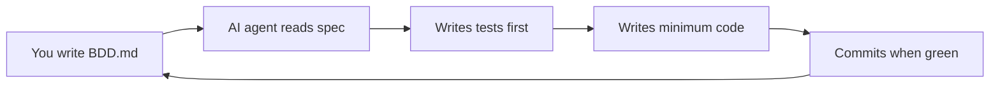
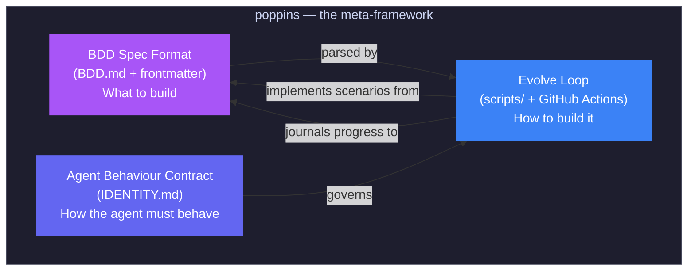
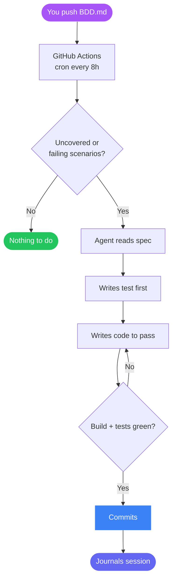

## What is poppins?

poppins is a **meta-framework** — not a library you install, but a pattern you adopt. You bring your spec; poppins brings the agent, the loop, and the rules that keep it honest.

The name stands for **Behaviour and AI Driven Development**. The core idea is simple:

> **You write the spec. The agent writes the code.**

You describe your project's features and scenarios in a single file (`BDD.md`) using plain [Gherkin](https://cucumber.io/docs/gherkin/) syntax — the same Given/When/Then format used in traditional BDD. An AI agent then reads that spec, writes tests first, writes the minimum code to make them pass, and commits the result. Every 8 hours, a GitHub Actions cron triggers a new session and the agent picks up where it left off.



You never touch the implementation code unless you want to. You steer the project entirely through the spec.

## Why does this exist?

Most AI coding tools help you write code faster. poppins takes a different approach: it removes you from the implementation loop entirely and puts you in the **specification loop** instead.

This matters because:

- **Specifications are durable.** Code changes constantly, but well-written scenarios describe _what the system does_ — and that changes far less often.
- **Tests come free.** Because the agent writes the test before the code, every feature ships with regression protection from day one.
- **The agent stays honest.** Traditional AI coding assistants can drift, over-engineer, or add features you didn't ask for. poppins constrains the agent with a constitution (`IDENTITY.md`) — it can only build what's in the spec, it must write tests first, and it must journal what it did.
- **It runs while you sleep.** The cron fires every 8 hours. You push a new scenario to `BDD.md` before bed; by morning the agent has implemented it, committed, and moved on.

## How it works — the big picture

poppins has three parts that work together:



### 1. BDD Spec Format — what to build

`BDD.md` is the single source of truth. Its YAML frontmatter declares the language, framework, and build/test commands. Below that, you write features and scenarios in Gherkin:

```gherkin
---
language: typescript
build_cmd: npm run build
test_cmd: npm test
---

System: A task management API

    Feature: Task CRUD
        As an API consumer
        I want to create and list tasks
        So that I can manage work items

        Scenario: Create a task
            Given the API is running
            When I POST /tasks with {"title": "Buy milk"}
            Then I receive a 201 response
```

This is the only file you need to edit. Everything else flows from it.

### 2. Evolve Loop — how to build it

The `scripts/` directory and GitHub Actions workflow form the evolution loop. Every session follows the same cycle:



The loop is self-healing — if the agent can't fix a broken build after 3 attempts, the entire session is reverted. Broken code never gets pushed.

### 3. Agent Behaviour Contract — how the agent must behave

`IDENTITY.md` is the agent's constitution. It defines hard rules:

- **BDD.md is the spec.** If it's not in BDD.md, the agent doesn't build it.
- **Tests before code.** Always.
- **Every change must pass.** If it breaks something, it reverts.
- **Journal every session.** What worked, what didn't, what's next.
- **Never delete tests.** Tests protect the project from regression.
- **Never modify the constitution.** The agent cannot change its own rules.

These constraints prevent the failure modes that make autonomous coding tools unreliable — scope creep, untested code, silent breakage, and undocumented changes.

## What makes it different

| | Traditional AI coding | poppins |
|---|---|---|
| **You write** | Prompts, code, reviews | Specifications only |
| **Agent scope** | Whatever you ask for | Only what's in BDD.md |
| **Testing** | Optional, often skipped | Mandatory, test-first |
| **Runs when** | You trigger it | Every 8h on autopilot |
| **Accountability** | Chat history | Journals, BDD status, git history |
| **Guardrails** | None | Constitution + revert-on-failure |

## Supported languages and providers

poppins is language-agnostic. Set the `language` field in your `BDD.md` frontmatter and the agent sets up the toolchain automatically:

**Languages:** TypeScript, Python, Rust, Go, Java, Node.js

**AI Providers:** Anthropic, OpenAI, Groq, Alibaba/Qwen, Moonshot/Kimi, Ollama (local)

Provider detection is automatic — set one API key as an environment variable and poppins uses it. No configuration needed.

## Interactive mode with Claude Code

If you prefer to guide the agent in real time rather than waiting for the cron, you can use [Claude Code](https://claude.ai/code). Type `evolve` and the agent reads the spec, picks the next scenario, implements it, and asks if you want to continue — same workflow, but interactive.

## Next steps

Ready to try it? Head to the [Installation](/POPPINS/getting-started/installation/) guide to scaffold your first project, or jump straight to the [Quick Start](/POPPINS/getting-started/quick-start/) for a complete walkthrough.
