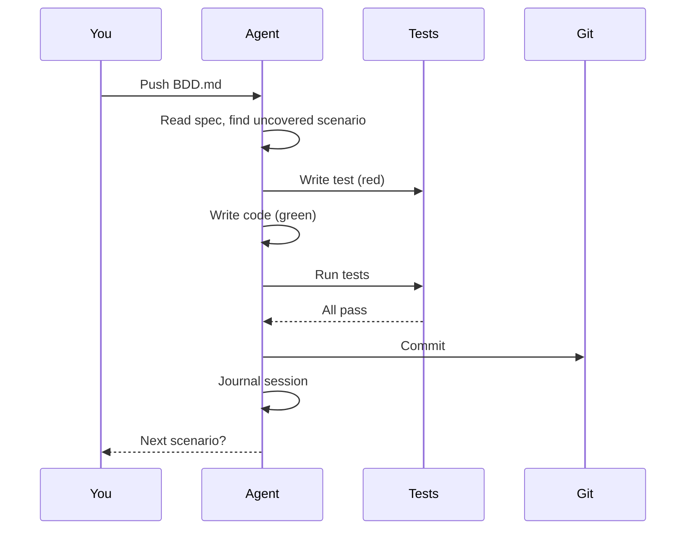

## 1. Install poppins

```bash
mkdir my-todo-app && cd my-todo-app
curl -fsSL https://raw.githubusercontent.com/dweng0/POPPINS/main/install.sh | bash
```

## 2. Write your spec

Edit `BDD.md`. Set the frontmatter for your language, then describe your features:

```yaml
---
language: typescript
framework: react-vite
build_cmd: npm run build
test_cmd: npm test
lint_cmd: npm run lint
fmt_cmd: npm run format
birth_date: 2026-01-01
---
```

Then add your scenarios below the frontmatter:

```gherkin
System: A simple todo list application

    Feature: Task management
        As a user
        I want to manage my tasks
        So that I can stay organised

        Scenario: Add a task
            Given I have an empty task list
            When I add a task called "Buy milk"
            Then the task list contains "Buy milk"

        Scenario: Complete a task
            Given I have a task called "Buy milk"
            When I mark "Buy milk" as complete
            Then "Buy milk" is shown as completed

        Scenario: Delete a task
            Given I have a task called "Buy milk"
            When I delete "Buy milk"
            Then the task list is empty
```

## 3. Add your API key

### For GitHub Actions (automated)

Go to your GitHub repo: **Settings → Secrets and variables → Actions → New repository secret**

| Name | Value |
|------|-------|
| `ANTHROPIC_API_KEY` | your `sk-ant-...` key |

### For local runs

```bash
export ANTHROPIC_API_KEY=sk-ant-...
```

Or create a `.env` file in your project root:

```
ANTHROPIC_API_KEY=sk-ant-...
```

## 4. Run your first evolution

### Option A: Automated (GitHub Actions)

Push to GitHub. The workflow runs automatically every 8 hours:

```bash
git add -A && git commit -m "Initial BDD spec"
git push
```

Trigger manually from **Actions tab → Evolution → Run workflow**.

### Option B: Local run

```bash
pip install anthropic
./scripts/evolve.sh
```

### Option C: Interactive with Claude Code

If you have [Claude Code](https://claude.ai/code) installed:

```
> evolve
```

Claude Code reads the spec, picks the next uncovered scenario, writes the test, implements it, and commits — then asks if you want to continue.

## 5. Watch it work

The agent will:



After each session, check:
- `BDD_STATUS.md` — which scenarios are covered
- `JOURNAL.md` — what the agent did
- `JOURNAL_INDEX.md` — one-line summary per session

## Example: what the agent produces

After running against the todo app spec above, you'd see commits like:

```
2026-01-01 08:00: implement "Add a task" scenario
2026-01-01 08:00: implement "Complete a task" scenario
2026-01-01 08:00: implement "Delete a task" scenario
2026-01-01 08:00: update BDD status
2026-01-01 08:00: journal entry
```

Each commit contains a test file and the implementation code that makes it pass.
