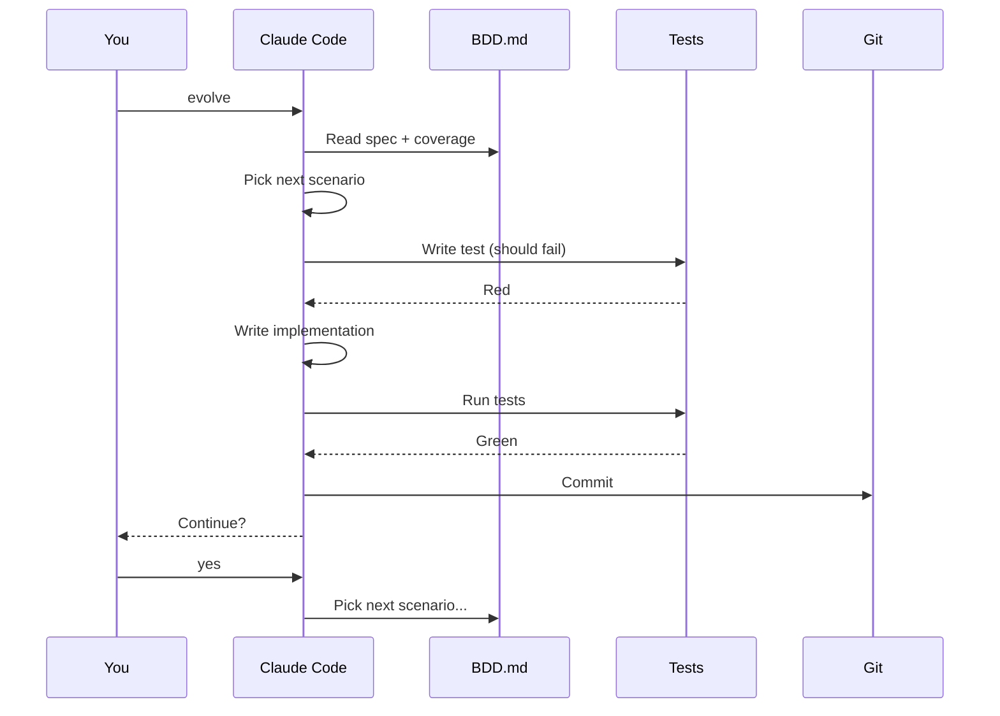

If you have [Claude Code](https://claude.ai/code) installed, you can run evolution sessions interactively instead of waiting for the cron.

## How it works

Type `evolve` in your Claude Code terminal and the agent will:

1. Read `IDENTITY.md`, `BDD.md`, `BDD_STATUS.md`, and `JOURNAL_INDEX.md`
2. Fetch trusted GitHub issues
3. Check BDD coverage
4. Pick the highest-priority uncovered scenario
5. Write the test, confirm it fails
6. Write the code, confirm it passes
7. Commit
8. Ask if you want to continue to the next scenario

## Interactive vs automated

| | Claude Code | GitHub Actions |
|---|---|---|
| **Trigger** | You type `evolve` | Cron every 8h |
| **Feedback** | Real-time, interactive | Check logs after |
| **Guidance** | You can steer the agent | Fully autonomous |
| **Speed** | As fast as you want | One session per trigger |
| **Same workflow** | Yes | Yes |

Both use the same BDD spec, same rules, same test-first approach. The only difference is interactivity.

## Tips

- **Guide scenario priority** — if you want a specific scenario next, tell Claude Code
- **Review as you go** — you can review each commit before continuing
- **Fix issues live** — if a test isn't quite right, edit it and ask Claude to retry
- **Add scenarios on the fly** — add a new scenario to `BDD.md` and ask Claude to implement it
