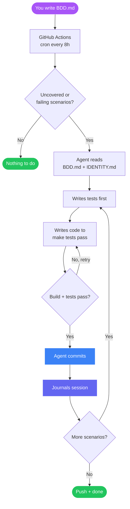
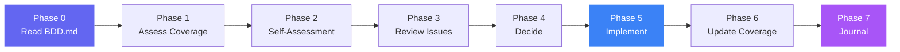
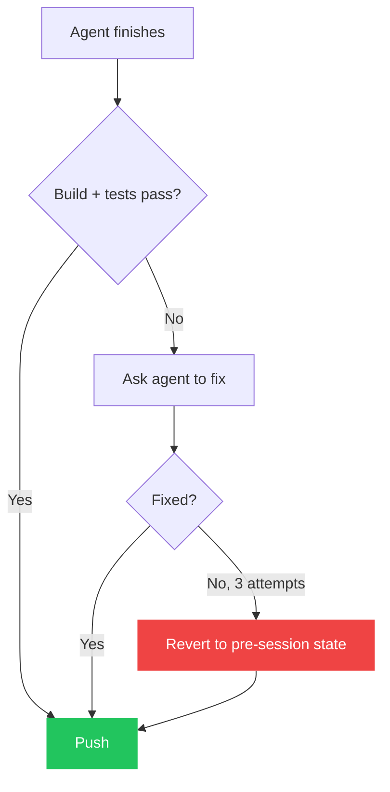

The evolution loop is the core of poppins. It runs every 8 hours via GitHub Actions (or manually), reads your spec, and implements uncovered scenarios.

## The cycle



## The 8 phases

Each evolution session follows a strict sequence:



### Phase 0 — Read the spec
The agent reads `IDENTITY.md` (its rules), `BDD.md` (the spec), `BDD_STATUS.md` (coverage), and `JOURNAL_INDEX.md` (past sessions).

### Phase 1 — Assess coverage
Run `check_bdd_coverage.py` to find scenarios that are **uncovered** (no test) or **failing** (test exists but doesn't pass).

### Phase 2 — Self-assessment
The agent reads the project source code and looks for broken builds, wrong tests, or technical debt blocking coverage.

### Phase 3 — Review issues
The agent reads `ISSUES_TODAY.md` — community requests fetched from GitHub Issues. If an issue proposes a feature, the agent adds a Scenario to `BDD.md` first.

### Phase 4 — Decide
Priority order:
1. Fix CI failures
2. Fix crash/data-loss bugs in covered scenarios
3. Implement highest-priority uncovered scenario (top of BDD.md)
4. Fix failing tests
5. New scenarios from community issues

### Phase 5 — Implement
For each scenario: write test → confirm it fails → write code → confirm it passes → commit.

If checks fail after 3 attempts, the agent reverts and moves on.

### Phase 6 — Update coverage
Regenerate `BDD_STATUS.md` with current pass/fail status.

### Phase 7 — Journal
Write a session log to `JOURNAL.md` describing what was done, what worked, what didn't, and what's next.

## Post-session safety

After the agent finishes, `evolve.sh` runs a verification step:



The evolve script will never push broken code. If the agent can't fix it after 3 attempts, the entire session is reverted.

## Running manually

```bash
# Set your API key
export ANTHROPIC_API_KEY=sk-ant-...

# Run one evolution session
./scripts/evolve.sh
```

The script auto-detects your provider from environment variables. You can also force a provider or model:

```bash
# Use a specific model
MODEL=claude-sonnet-4-5 ./scripts/evolve.sh

# Use OpenAI instead
OPENAI_API_KEY=sk-... ./scripts/evolve.sh
```

## Triggering from GitHub Actions

The workflow runs on a cron schedule, but you can also trigger it manually:

**Actions tab → Evolution → Run workflow**

Or via the CLI:

```bash
gh workflow run evolve.yml
```
