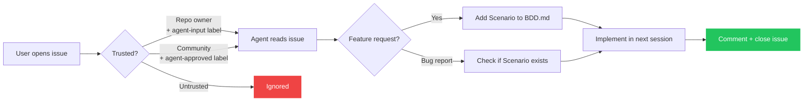

The poppins agent can pick up work from GitHub Issues. This lets contributors propose features or report bugs without touching the codebase directly.

## How it works

## Trust model

The agent only acts on **trusted** issues to prevent prompt injection:

1. **Repo owner issues** — any issue authored by the repo owner with the `agent-input` label is automatically trusted
2. **Community-approved issues** — any issue with the `agent-approved` label, but only if that label was applied by the repo owner (enforced by a GitHub Actions workflow)

All other issues are ignored.

## Labelling issues

### As the repo owner

Add the `agent-input` label to your own issues — the agent will pick them up in the next session.

### For community contributions

1. A community member opens an issue describing a feature or bug
2. The repo owner reviews it
3. If approved, the owner adds the `agent-approved` label
4. The agent picks it up in the next session

## What the agent does with issues

- **Feature requests** → the agent adds a new Scenario to `BDD.md` first, then implements it
- **Bug reports** → the agent checks if an existing Scenario covers the case, then fixes it
- **After implementation** → the agent comments on the issue with the commit hash and closes it

The agent never implements something that isn't in `BDD.md`, even if an issue asks for it directly. The spec is always the source of truth.
